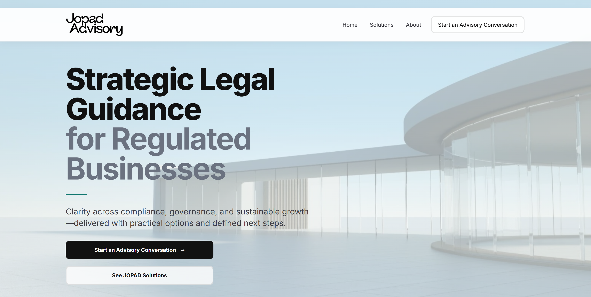
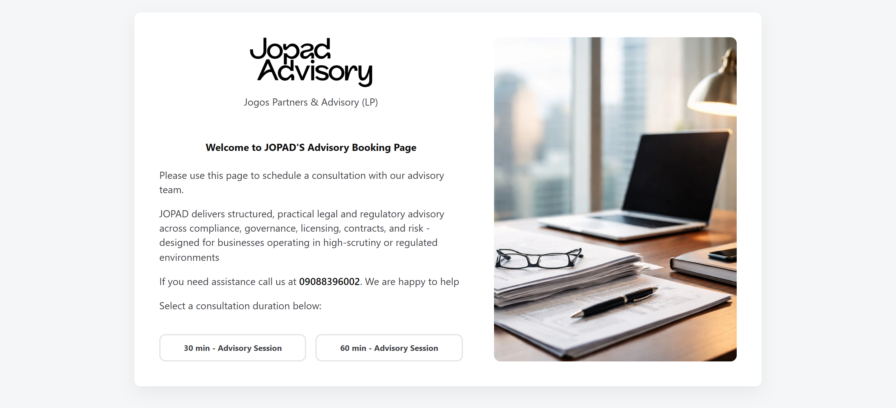
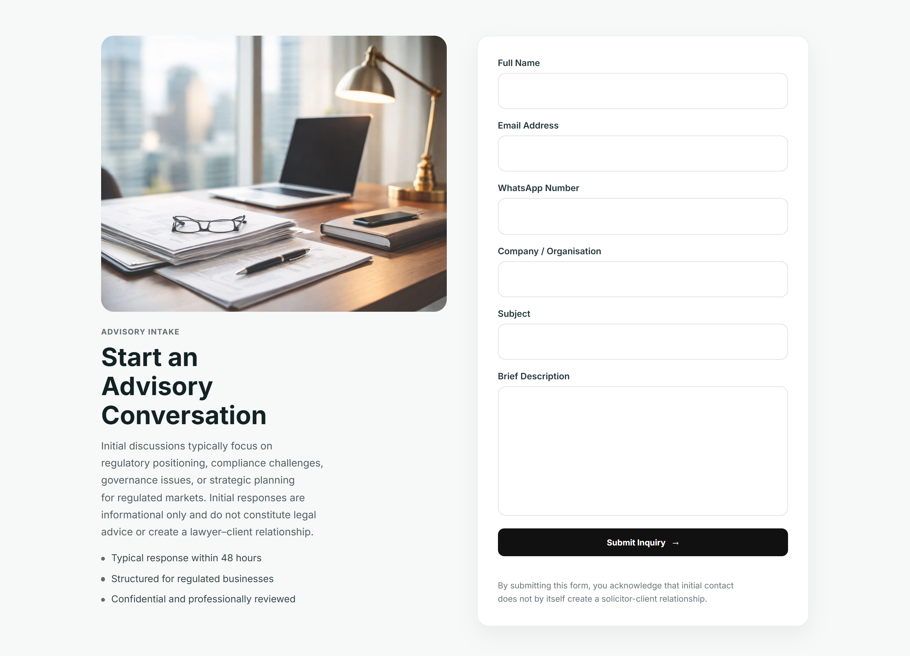

# 🚀 JOPAD Advisory Website

A modern, responsive web platform for JOPAD Advisory, built to deliver seamless advisory booking, client intake, and automated communication workflows.

---

## 🌐 Live Site  
https://jopadconsulting.com  

---

## 📌 Overview  

This project is a full-stack advisory platform, not just a static website.  

It enables clients to:  
- Book advisory sessions  
- Submit intake forms  
- Receive automated confirmations  
- Get calendar scheduling via Google Calendar  

At the same time, it provides the business with:  
- Data storage (MongoDB)  
- Backup (Airtable)  
- Automated email workflows  

---

## 📸 Screenshots

### Booking System

### Intake Form

### Email Notification
<!--  -->

## 🚀 Features  

### 🎯 Frontend
- Fully responsive design (mobile, tablet, desktop)  
- Clean, modern UI/UX  
- Optimized performance  
- SEO-ready structure  

### 📅 Advisory Booking System
- Real-time booking with conflict detection  
- Google Meet link auto-generation  
- Google Calendar integration  
- Time slot validation  

### 📝 Intake System
- Custom intake form (replacing Make.com)  
- Spam protection (honeypot field)  
- Structured data collection  

### 📧 Email System (Resend)
- Branded email notifications  
- Client confirmation emails  
- Admin alert emails  
- Reply-to support  
- HTML email templates  

### 🗄 Data Management
- MongoDB (primary database)  
- Airtable (backup + external access)  

---

## 🛠 Tech Stack  

### Frontend
- HTML5  
- CSS3  
- JavaScript  

### Backend
- Node.js  
- Express.js  

### Services & Integrations
- Vercel – frontend hosting  
- Render – backend hosting  
- MongoDB – primary database  
- Airtable – backup storage  
- Resend – email delivery  
- Google Calendar – scheduling integration  

---

## 📁 Project Structure  

/project-root
│
├── frontend/
│   ├── index.html
│   ├── css/
│   ├── js/
│   └── images/
│
├── backend/
│   ├── routes/
│   │   ├── advisoryRoutes.js
│   │   └── intakeRoutes.js
│   ├── models/
│   │   ├── Booking.js
│   │   └── Intake.js
│   ├── utils/
│   │   ├── sendEmail.js
│   │   └── googleCalendar.js
│   └── server.js
│
├── sitemap.xml
├── robots.txt
└── README.md

---

## ⚙️ Deployment  

- Frontend deployed via Vercel  
- Backend deployed via Render  

Note:  
Render free tier may experience cold starts, which can delay API responses.

---

## 📧 Email Workflow  

Powered by Resend  

### Booking Flow:
1. User books session  
2. Backend creates Google Calendar event  
3. Emails sent:
   - Client confirmation  
   - Admin notification  

### Intake Flow:
1. User submits intake form  
2. Data saved to MongoDB  
3. Backup sent to Airtable  
4. Emails sent:
   - Admin notification  
   - (Optional) client acknowledgment  

---

## 📈 SEO & Optimization  

- Meta tags implemented  
- Open Graph tags configured  
- Sitemap and robots.txt included  
- Optimized assets and images  

---

## 🔐 Security Considerations  

- Environment variables for API keys  
- Honeypot spam protection  
- Backend validation for all requests  
- No sensitive data exposed on frontend  

---

## 📄 License  

This project is proprietary and developed for client use only.

---

## 🤝 Acknowledgements  

Developed as a full-stack advisory platform for JOPAD Advisory, combining scheduling, communication, and client management into one seamless system.

---

## 🔥 Future Improvements  

- Email analytics & delivery tracking  
- Admin dashboard  
- Payment integration  
- Custom domain email (Google Workspace)  
- Queue system for bookings